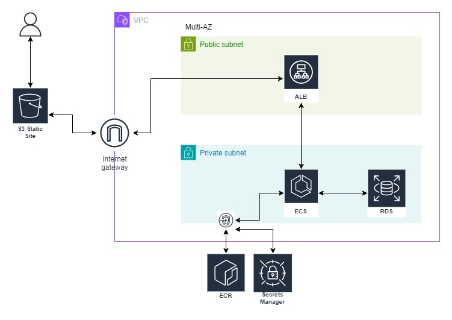

# Go Paper

A full-stack web application to manage a reading list of papers.

The application is composed of a React frontend and a REST API developed in Go. The infrastructure is deployed on AWS utilizing a wide array of AWS services, and is provisioned through Terraform.

## Architecture

The architecture follows a 3-tier pattern for scalability and fault tolerance. Deployed in a VPC across multiple Availability Zones (AZs) for high availability, the frontend is served via S3 static hosting. An Application Load Balancer routes client requests to the backend running in an ECS Fargate cluster.



### Key Components:

- **Frontend (React App)**: Hosted on **S3** as a static website.
- **Backend (Go REST API)**: Containerized and running on **ECS (Elastic Container Service)**.
- **Load Balancer**: The API is exposed via an **Application Load Balancer (ALB)**, providing a public entry point.
- **Database**: Managed relational database service using **Amazon RDS** for persistent storage.
- **Elastic Container Registry (ECR)**: Stores container images for the backend application.
- **Secrets Manager**: Securely manages credentials, such as database credentials, API keys, etc.

### Network Design

- **Public Subnets**: Deployed across multiple AZs, the ALB is hosted here to expose the backend API to the internet.
- **Private Subnets**: ECS and RDS are deployed in private subnets to ensure security. The backend service can communicate with AWS Services via AWS PrivateLink.
- **Multi-AZ Setup**: The VPC spans multiple availability zones for high availability and resilience.

## Getting Started

### Prerequisites

- [AWS CLI](https://aws.amazon.com/cli/) installed and configured.
- [Terraform](https://www.terraform.io/) installed.
- [Docker](https://www.docker.com/) installed for local development and containerization.

### Steps to Run Locally

1. Clone the repository:
   ```bash
   git clone https://github.com/marvinlanhenke/go-paper.git
   ```
2. Run the backend:
   ```bash
   docker compose up -d
   ```
3. Build the frontend & preview
   ```bash
   make frontend-preview
   ```

## Deployment

The infrastructure can be provisioned using Terraform. Ensure your AWS credentials are set up, then run the following commands:

1. Initialize Terraform:
   ```bash
   terraform init
   ```
2. Plan and apply the infrastructure:
   ```bash
   terraform apply
   ```
3. Deploy the application
   ```bash
   make deploy
   ```

## What could be improved

- Use a CDN to serve the frontend on the edge
- Use RDS Read-Replicas
- Utilize the AWS SecretsManager to savely share secrets with the backend application

## License

This project ist licensed under the Apache License, Version 2.0
